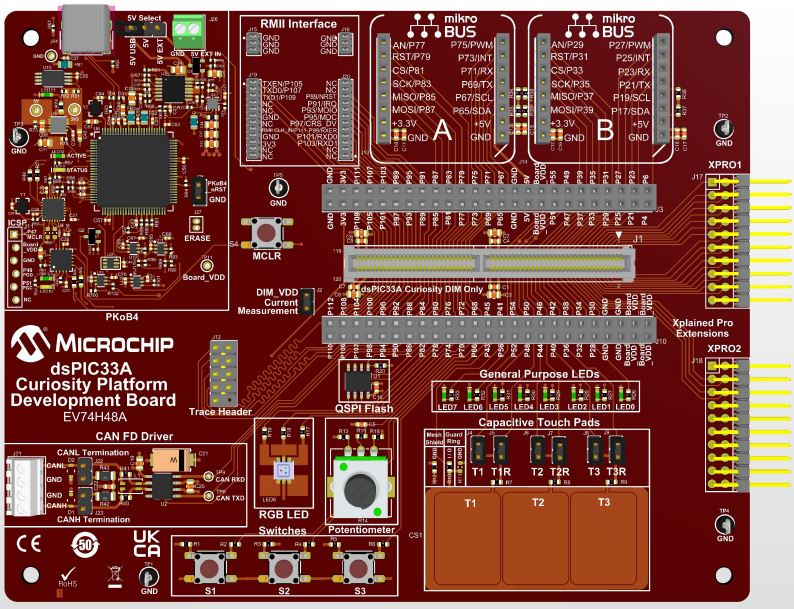

<picture>
    <source media="(prefers-color-scheme: dark)" srcset="../images/microchip_logo_white_red.png">
	<source media="(prefers-color-scheme: light)" srcset="../images/microchip_logo_black_red.png">
    
</picture>

## dsPIC33AK128MC106 Curiosity GP DIM Out of Box Demo

## Summary
Demonstrates the basic capability of the dsPIC33AK128MC106 on the dsPIC33A Curiosity Platform Development Board

## Related Documentation
1) dsPIC33AK128MC106 Curiosity GP DIM User's Guide: TBD
2) dsPIC33A Curiosity Platform Development Board User's Guide: TBD

## Software Used 
1) MPLAB X 6.15 or later
2) XC-DSC 3.00 or later
3) dsPIC33AK-MC_DFP 1.0.2 or later

## Hardware Used
1) dsPIC33AK128MC106 Curiosity GP DIM
2) dsPIC33A Curiosity Platform Development Board

## Setup
1) Connect the dsPIC33AK128MC106 Curiosity GP DIM to the dsPIC33A Curiosity Platform Development Board
2) Connect the USB-C port to a host computer
3) Compile and program the demo into the board
4) Open a serial terminal program to 9600 8-N-1 to the port associated with the board

## Operation

| *User Interaction* | *Demo Behavior* |
| ---------------- | ------------- |
| None             | All LEDs LED0-LED7 are off.  The RGB LED is cycling between colors. Potentiometer value displayed in serial terminal program (9600 8-N-1) |
| Hold switch S1   | All LEDs LED0-LED7 are on |
| Hold switch S2   | All LEDs LED0-LED7 blink in unison |
| Hold switch S3   | LEDs LED0-LED7 cycle on one at a time |
| Adjust potentiometer | Updated potentiometer value displayed in serial terminal program |
| Pressing '0' in terminal | LED0 toggles |
| Pressing '1' in terminal | LED1 toggles |
| Pressing '2' in terminal | LED2 toggles |
| Pressing '3' in terminal | LED3 toggles |
| Pressing '4' in terminal | LED4 toggles |
| Pressing '5' in terminal | LED5 toggles |
| Pressing '6' in terminal | LED6 toggles |
| Pressing '7' in terminal | LED7 toggles |

 

