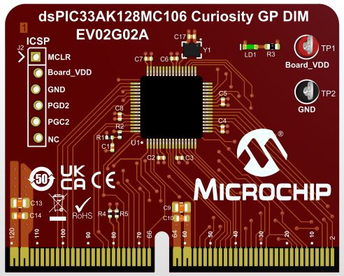

<picture>
    <source media="(prefers-color-scheme: dark)" srcset="../images/microchip_logo_white_red.png">
	<source media="(prefers-color-scheme: light)" srcset="../images/microchip_logo_black_red.png">
    
</picture>

## dsPIC33AK128MC106 Curiosity GP DIM Out of Box Demo

## Summary
Demonstrates the basic capability of the dsPIC33AK128MC106 on the dsPIC33A Curiosity Platform Development Board

## Related Documentation
1) [dsPIC33AK128MC106 Curiosity GP DIM User's Guide](https://www.microchip.com/70005556)
2) [dsPIC33A Curiosity Platform Development Board User's Guide](https://www.microchip.com/70005562)

## Software Used 
1) MPLAB X 6.20 or later with the following component versions:
    * RI4 > 1.2.13
    * ControlPointMediator > 1.3
    * RealICE4ToolsController > 1.2
    
    Note: If using MPLAB X 6.20, three patches are required for dsPIC33A support. If not automatically installed, these patches can be found under Tools -> Plugins 
    
2) XC-DSC 3.10 or later
3) dsPIC33AK-MC_DFP 1.0.33 or later
4) Toolpacks for the programmer of choice:
    * PKOB 4 > 1.16.1230
    * PICkit 4 > 2.5.1929
    * PICkit 5 > 2.5.391
    * ICD4 > 2.5.1856
    * ICD5 > 2.5.367

## Hardware Used
1) [dsPIC33AK128MC106 Curiosity GP DIM](https://www.microchip.com/EV02G02A)
2) [dsPIC33A Curiosity Platform Development Board](http://www.microchip.com/EV74H48A)

## Setup
1) Connect the dsPIC33AK128MC106 Curiosity GP DIM to the dsPIC33A Curiosity Platform Development Board
2) Connect the USB-C port to a host computer
3) Compile and program the demo into the board
4) Open a serial terminal program to 9600 8-N-1 to the port associated with the board

## Operation
After completing the board setup in the prior section, you may interact with the board in the following ways:

**Basic I/O**
* LED7 reflects the status of the S1 button; On when pressed, off when released.
* LED6 reflects the status of the S2 button; On when pressed, off when released.
* LED5 reflects the status of the S3 button; On when pressed, off when released.

**ADC/PWM**
* Turning the potentiometer will vary the RGB LED brightness

**UART**
* Sending the ASCII characters 'r'(0x72), 'g'(0x67), or 'b'(0x62) over the UART (9600 8-N-1) will toggle the red/green/blue LEDs of the RGB LED respectively.
* A terminal program can be used to view the potentiometer value over the UART.

**Unsupported Board Features**
* This DIM does not support CAN functionality
* This DIM does not support the capacitive touch portion of the demo described in the dsPIC33A Curiosity Platform Board user's guide.

 

