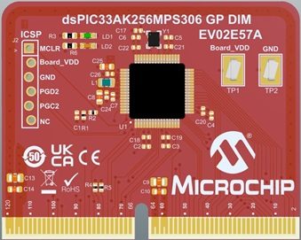
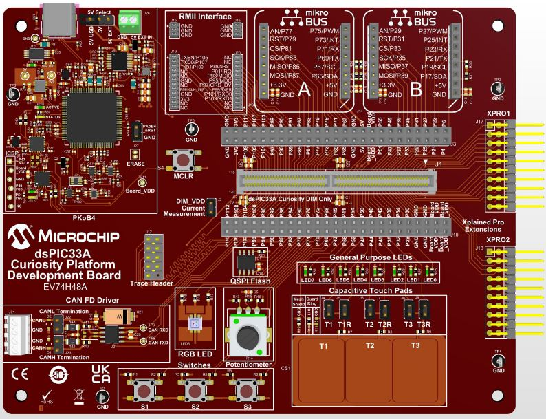
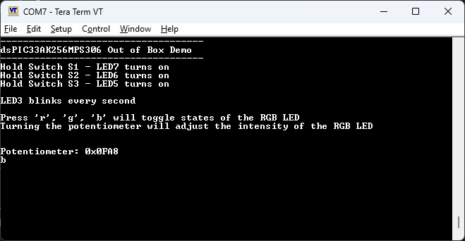
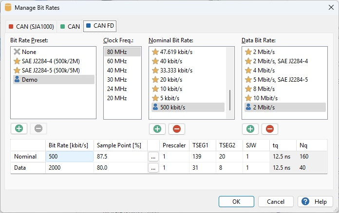
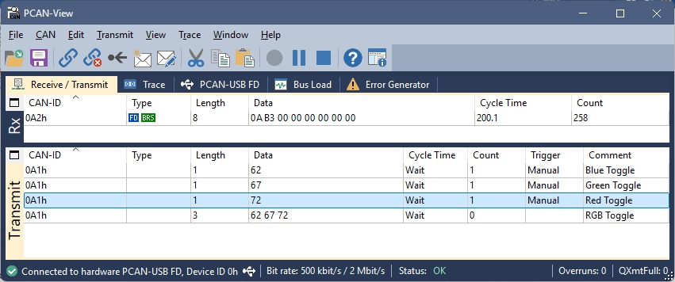
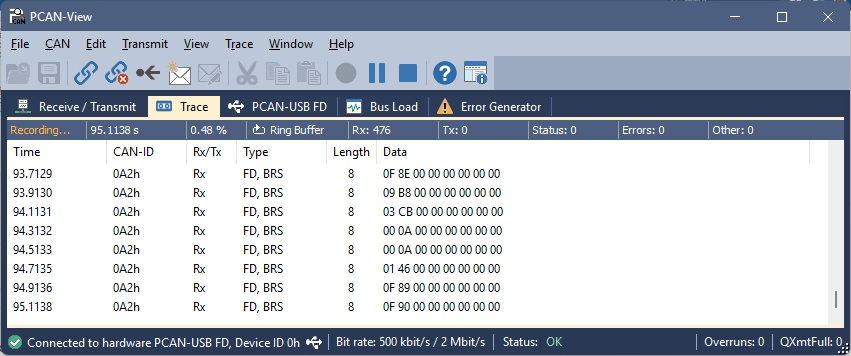

<picture>
    <source media="(prefers-color-scheme: dark)" srcset="images/microchip_logo_white_red.png">
	<source media="(prefers-color-scheme: light)" srcset="images/microchip_logo_black_red.png">
    
</picture>

# dsPIC33AK256MPS306 Curiosity GP DIM Out of Box Demo

## Summary
Demonstrates the basic capability of the dsPIC33AK256MPS306 on the Curiosity Platform Development Board

## Related Documentation
1) [dsPIC33AK256MPS306 Curiosity GP DIM User's Guide](http://www.microchip.com/EV02E57A)
2) [Curiosity Platform Development Board User's Guide](https://www.microchip.com/70005562)

## Software Used 
1) MPLAB® Tools for Microsoft® Visual Studio Code (VS Code)
2) XC-DSC 3.31 or later
3) dsPIC33AK-MP_DFP 1.3.185 or later

## Hardware Used
1) [dsPIC33AK256MPS306 Curiosity GP DIM User's Guide](http://www.microchip.com/EV02E57A)
2) [Curiosity Platform Development Board](http://www.microchip.com/EV74H48A)

## MPLAB Tools for Visual Studio Code File Generation Structure

| Path                                         | Purpose                                                                                                                             |
|----------------------------------------------|-------------------------------------------------------------------------------------------------------------------------------------|
| _build                                       | The [CMake build tree](https://cmake.org/cmake/help/latest/manual/cmake.1.html#introduction-to-cmake-buildsystems), can be deleted. |
| cmake                                        | Generated [CMake](https://cmake.org/) files. May be deleted if user.cmake has not been added                                        |
| .vscode                                      | See [VSCode](https://code.visualstudio.com/docs/getstarted/settings)                                                                |
| .vscode\settings.json                        | Workspace specific settings                                                                                                         |
| .vscode\dspic33ak256mps306_gp_dim.mplab.json | The MPLAB project file, should not be deleted                                                                                       |
| out                                          | Final build artifacts                                                                                                               |

## Setup
1) Connect the dsPIC33AK256MPS306 Curiosity GP DIM to the Curiosity Platform Development Board
2) Connect the USB-C port to a host computer
3) Open a serial terminal program to 115200 8-N-1 to the port associated with the board
4) Compile and program the demo into the board
5) If using CAN, connect a CAN analyzer/generator with appropriate termination to the J21 terminal and short both the termination jumpers on the Curiosity Platform Development Board (J22 and J23)

## Operation
After completing the board setup in the prior section, you may interact with the board in the following ways:

### Basic I/O
* LED7 reflects the status of the S1 button; On when pressed, off when released.
* LED6 reflects the status of the S2 button; On when pressed, off when released.
* LED5 reflects the status of the S3 button; On when pressed, off when released.
* LED3 is a blink alive and toggles blinks every 1 second based on a timer.

### ADC/PWM
* Turning the potentiometer will vary the RGB LED brightness

### UART
* Sending the ASCII characters 'r'(0x72), 'g'(0x67), or 'b'(0x62) over the UART (115200 8-N-1) will toggle the red/green/blue LEDs of the RGB LED respectively.
* A terminal program can be used to view the potentiometer value over the UART.

### CAN-FD Demo Operation
The CAN FD module is configured for the following settings:

| Type    | Clock  | Bit rate | Sample Point | Prescaler | TSEG1 | TSEG2 | SJW | tq      | Nq  |
|---------|--------|----------|--------------|-----------|-------|-------|-----|---------|-----|
| Nominal | 80 MHz | 500 kbps | 87.5%        | 1         | 139   | 20    | 1   | 12.5 ns | 160 |
| Data    | 80 MHz | 2 Mbps   | 80.0%        | 1         | 31    | 8     | 1   | 12.5 ns | 40  |

Sending the ASCII characters 'r'(0x72), 'g'(0x67), or 'b'(0x62) over the CAN-FD on CAN ID 0xA1 will toggle the red/green/blue LEDs of the RGB LED respectively.  You can send as many codes in a frame as you like of these characters and the associated LED will toggle on/off.

A CAN protocol analyzer can be used to view the potentiometer.  The potentiometer value is sent out in binary form on CAN ID 0xA2 every 200ms.

## Unsupported Board Features
* The touch pad capability is currently unsupported in this demo

 

