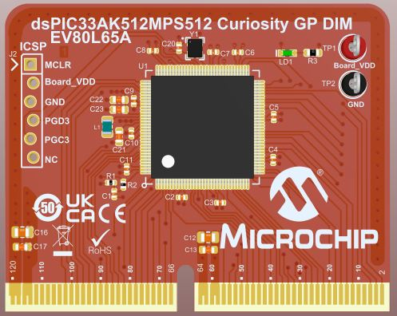
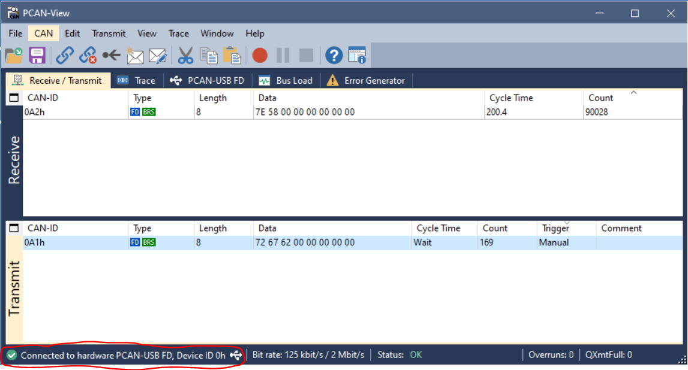
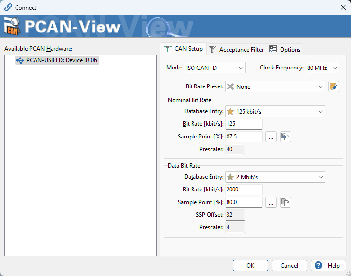
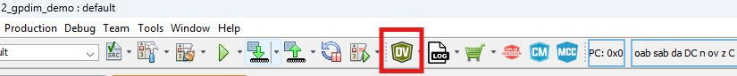
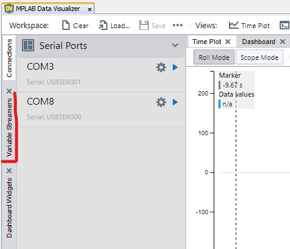
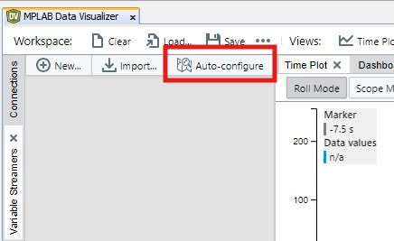
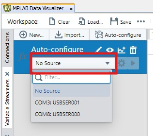
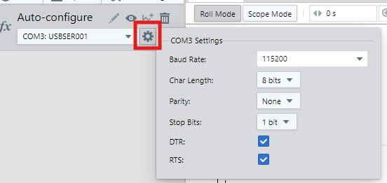
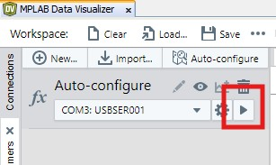
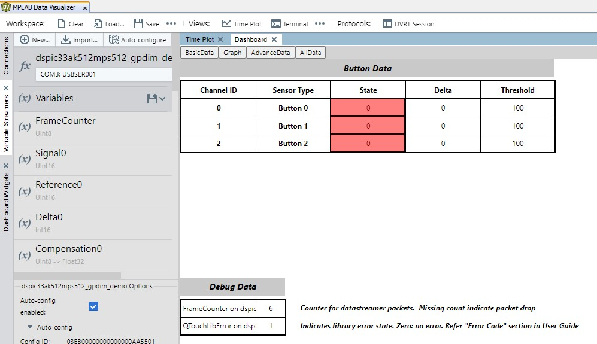

<picture>
    <source media="(prefers-color-scheme: dark)" srcset="../images/microchip_logo_white_red.png">
	<source media="(prefers-color-scheme: light)" srcset="../images/microchip_logo_black_red.png">
    
</picture>

## dsPIC33AK512MPS512 Curiosity GP DIM Out of Box Demo

## Summary
Demonstrates the basic capability of the dsPIC33AK512MPS512 on the dsPIC33A Curiosity Platform Development Board

## Related Documentation
1) dsPIC33AK512MPS512 Curiosity GP DIM User's Guide: TBD
2) dsPIC33A Curiosity Platform Development Board User's Guide: TBD

## Software Used 
1) MPLAB X 6.25 or later
2) XC-DSC 3.21 or later
3) dsPIC33AK-MC_DFP 1.0.4 or later

## Hardware Used
1) dsPIC33AK512MPS512 Curiosity GP DIM
2) dsPIC33A Curiosity Platform Development Board

## Setup
1) Connect the dsPIC33AK512MPS512 Curiosity GP DIM to the dsPIC33A Curiosity Platform Development Board
2) Connect the USB-C port to a host computer
3) Compile and program the demo into the board
4) Open a serial terminal program to 115200 8-N-1 to the port associated with the board

## Operation

**Basic I/O**
* LED7 reflects the status of the S1 button; On when pressed, off when released.
* LED6 reflects the status of the S1 button; On when pressed, off when released.
* LED5 reflects the status of the S1 button; On when pressed, off when released.

**ADC/PWM**
* Turning the potentiometer will vary the RGB LED brightness

**UART**
* Sending the ASCII characters 'r'(0x72), 'g'(0x67), or 'b'(0x62) over the UART (115200 8-N-1) will toggle the red/green/blue LEDs of the RGB LED respectively.
* A terminal program can be used to view the potentiometer value over the UART.

**CAN-FD**
* CAN FD nominal bit rate 125kbit/s data bit rate 2Mbit/s sample. 

* Sending the ASCII characters 'r'(0x72), 'g'(0x67), or 'b'(0x62) over the CAN-FD on CAN ID 0xA1 will toggle the red/green/blue LEDs of the RGB LED respectively.  You can send as many codes in a frame as you like of these characters and the associated LED will toggle on/off.
* A CAN protocol analyzer can be used to view the potentiometer.  The potentiometer value is sent out in binary form on CAN ID 0xA2 every 200ms.

**Capacitive Touch**
* LED2 reflects the status of the T1 capacitive touch button; On when pressed, off when released.
* LED1 reflects the status of the T2 capacitive touch button; On when pressed, off when released.
* LED0 reflects the status of the T3 capacitive touch button; On when pressed, off when released.

**NOTE**: The touch library, located in mcc_generated_files/touch, contains pre-release code intended solely for demonstration purposes. It is not intended for production use.

**PEAK PCAN-View CAN bit rate setup**
* If using the PEAK USB CAN-FD Analyzer additional bit rates to the default bit rates may be needed to get consistent communication functioning with the dsPIC33A Curiosity Platform Development Board. The following steps are a guide to other tool provided bit rates that will improve communication.

1) In the PEAK PCAN-View software double click the bit rate settings in the bottom left (circled in red) to open the bit rates dialogue box. 

2) Ensure that both the nominal bit rate and data bit rate have similar sample points. If the sample points are different click the ellipsis (circled in red) to open an additional table of timing setting options. 

3) Select a timing setting similar to the selected data bit rate, and make a selection for the Sync Jump Width before selecting OK to both dialogue boxes to accept these settings.
4) Repeat these steps until there is consistent potentiometer messages being received in PCAN-View on CAN ID 0x0A2 ~every 200ms.

**Touch Button Detailed Information**
In normal operation on reset, text is printed to the UART as described above.  An alternate mode is provided where specific touch information is provided over the UART instead.  To enter this mode, hold S1, S2, and S3 on reset.  In this mode the demo will function the same except instead of printing human readable data to the UART, touch specific detailed information is streamed over the UART and can be viewed using the MPLAB X Data Visualizer tool.  The steps below describe how to enable this demo:

1) Hold S1, S2, and S3.  Press and release the reset button while holding these buttons down.
2) Close any terminal program you have open from the standard demo mode.
3) Open MPLAB X
4) In MPLAB X, click the data visualizer icon in the toolbar 

5) In the data visualizer window, select the "Variable Streamers" tab on the left side of the window 

6) Click the "Auto-configure" button 

7) In the "Sources" drop-down, select the correct COM port for your computer (NOTE: the platform curiosity board shows up as 2 COM ports so you may need to try each to find the correct one) 

8) Select the "Settings" gear icon next to the source and configure this for 115200 8-N-1 

9) Press the "Play" button 

10) The screen now shows the touch button detailed information.  Navigate the data visualizer UI while pressing the capacitive touch buttons to explore the functionality. 

 

