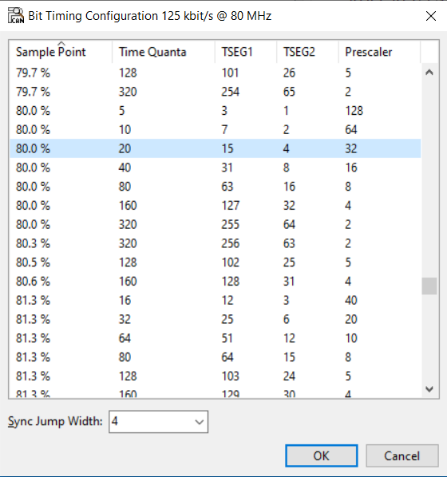

<picture>
    <source media="(prefers-color-scheme: dark)" srcset="../images/microchip_logo_white_red.png">
	<source media="(prefers-color-scheme: light)" srcset="../images/microchip_logo_black_red.png">
    
</picture>

## dsPIC33AK512MPS512 Curiosity GP DIM Out of Box Demo

## Summary
Demonstrates the basic capability of the dsPIC33AK512MPS512 on the dsPIC33A Curiosity Platform Development Board

## Related Documentation
1) dsPIC33AK512MPS512 Curiosity GP DIM User's Guide: TBD
2) dsPIC33A Curiosity Platform Development Board User's Guide: TBD

## Software Used 
1) MPLAB X 6.15 or later
2) XC-DSC 3.00 or later
3) dsPIC33AK-MC_DFP 1.0.4 or later

## Hardware Used
1) dsPIC33AK512MPS512 Curiosity GP DIM
2) dsPIC33A Curiosity Platform Development Board

## Setup
1) Connect the dsPIC33AK512MPS512 Curiosity GP DIM to the dsPIC33A Curiosity Platform Development Board
2) Connect the USB-C port to a host computer
3) Compile and program the demo into the board
4) Open a serial terminal program to 9600 8-N-1 to the port associated with the board

## Operation

**Basic I/O**
* LED7 reflects the status of the S1 button; On when pressed, off when released.
* LED6 reflects the status of the S1 button; On when pressed, off when released.
* LED5 reflects the status of the S1 button; On when pressed, off when released.

**ADC/PWM**
* Turning the potentiometer will vary the RGB LED brightness

**UART**
* Sending the ASCII characters 'r'(0x72), 'g'(0x67), or 'b'(0x62) over the UART (9600 8-N-1) will toggle the red/green/blue LEDs of the RGB LED respectively.
* A terminal program can be used to view the potentiometer value over the UART.

**CAN-FD**
* CAN FD nominal bit rate 125kbit/s data bit rate 2Mbit/s sample point ~80% for best communication.
* Sending the ASCII characters 'r'(0x72), 'g'(0x67), or 'b'(0x62) over the CAN-FD on CAN ID 0xA1 will toggle the red/green/blue LEDs of the RGB LED respectively.
* A CAN protocol analyzer can be used to view the potentiometer.  The potentiometer value is sent out in binary form on CAN ID 0xA2 every 200ms.

**Capacitive Touch**
* LEDs LED0-LED4 indicate the touch location of the T1-T3 touchpads. As your finger slides across these touchpads from right to left, the LEDs LED0-LED4 will incrementally illuminate from right to left to match.

**PEAK PCAN-View CAN bit rate setup**
* If using the PEAK USB CAN-FD Analyzer additional bit rates to the default bit rates may be needed to get consistent communication functioning with the dsPIC33A Curiosity Platform Development Board. The following steps are a guide to other tool provided bit rates that will improve communication.

1) In the PEAK PCAN-View software double click the bit rate settings in the bottom left (circled in red) to open the bit rates dialogue box.

2) Ensure that both the nominal bit rate and data bit rate have similar sample points. If the sample points are different click the ellipsis (circled in red) to open an additional table of timing setting options.

3) Select a timing setting similar to the selected data bit rate, and make a selection for the Sync Jump Width before selecting OK to both dialogue boxes to accept these settings.

4) Repeat these steps until there is consistent potentiometer messages being received in PCAN-View on CAN ID 0x0A2 ~every 200ms.
 

